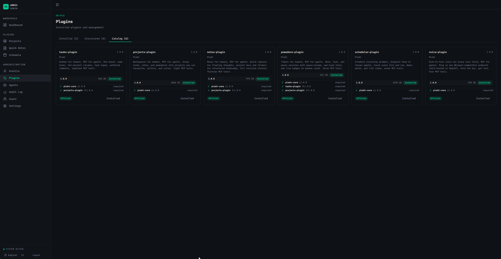
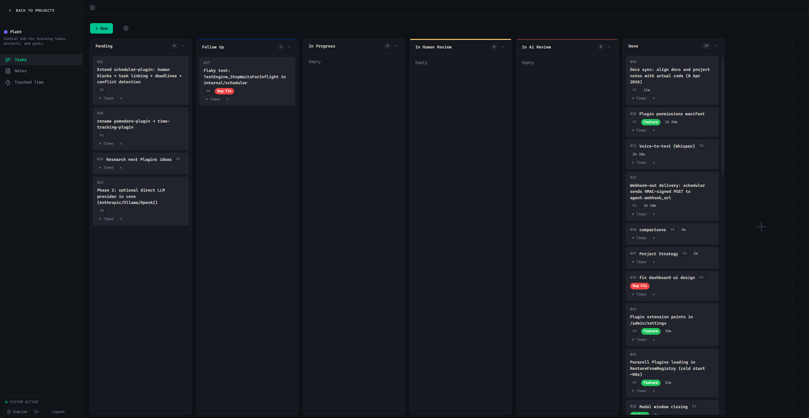
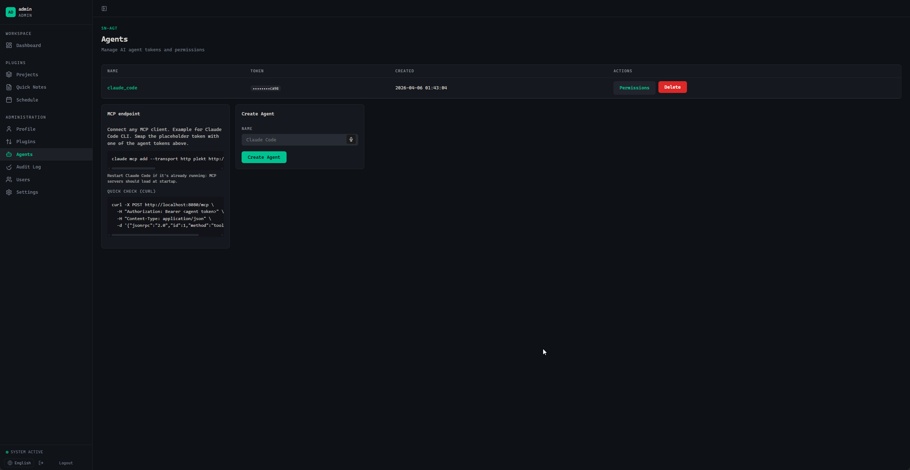
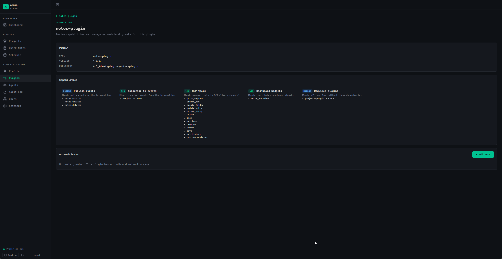
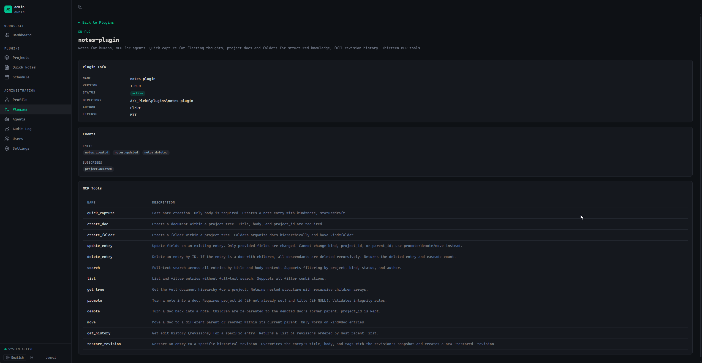
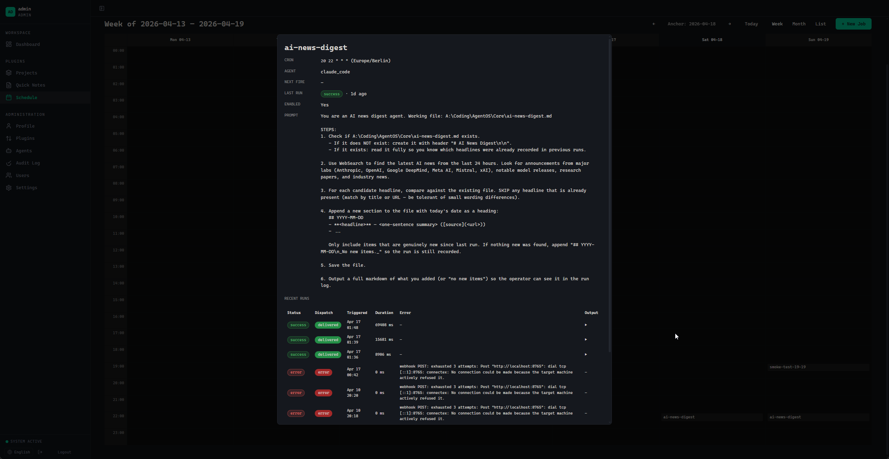

# Plekt

[](https://github.com/plekt-dev/plekt/actions/workflows/ci.yml)
[](https://codecov.io/gh/plekt-dev/plekt)
[](https://www.gnu.org/licenses/agpl-3.0)
[](https://go.dev/)

Self-hosted workspace where you and your AI work together.

WordPress-style plugin platform with one MCP endpoint on top.

## Why?

Most MCP setups give the AI tools but no home for the data those tools touch, and no UI for the human.
Plekt is both.

Each plugin is a mini-app with its own pages, its own SQLite file, and its own tools. The tools all merge into one
federated `/mcp` endpoint.
You control per-agent who can call what. Plugins live in the same process so they can share events, build on each other,
and the human gets a web UI over all of them.

Every plugin runs inside a WASM sandbox (Extism + Wazero), so a broken or malicious one can't touch the host beyond what
it was granted.

Project vision: a small team works together with their AI on real projects, state in one place, access shared per-agent
instead of copy-pasted between machines. Sharing/RBAC still maturing.

## Screenshots

|                                                               |                                                                            |
|---------------------------------------------------------------|----------------------------------------------------------------------------|
|  |       |
| Plugin catalog (signed installs from registry)                | Projects + tasks plugin                                                    |
|                   |  |
| Per-agent tokens, MCP endpoint card                           | Per-agent tool permissions                                                 |
|      |                          |
| Plugin Info View                                              | Scheduler plugin report                                                    |

More in [`docs/screenshots/`](docs/screenshots).

## Plugin model

Each plugin ships:

- **`plugin.wasm`**: the Extism module compiled from any language that targets WASM (Go, Rust, AssemblyScript, etc.).
  Sandboxed at runtime via Wazero. Host functions are explicit and granted per plugin.
- **`mcp.yaml`**: tool/event/host-permission manifest. Ed25519-signed.
- **`schema.yaml`**: declarative SQLite schema (tables, columns, indexes, foreign keys). Plekt's
  `internal/db.MigrationRunner` reads it on every load and applies missing tables / new columns / new indexes inside a
  single transaction. Idempotent, no Atlas/Goose, no SQL files to ship.
- **Optional**: templ pages, static assets, a global JS file.

Plugins talk to each other through a typed in-process **event bus**. Every plugin lifecycle change (`plugin.loaded`, `plugin.unloaded`, `plugin.schema.migrated`), every auth event (`auth.token.created`, `web.auth.login_failed`), and every domain event (`task.created`, `task.completed`, `comment.created`, ...) is broadcast. A plugin declares the events it cares about in `mcp.yaml` and gets a host function to subscribe. Lets the scheduler plugin react to `task.completed`, the audit subscriber log everything, the realtime SSE hub push UI updates, etc., without any plugin knowing about the others.

Example `schema.yaml`:

```yaml
version: "1"
tables:
  - name: entries
    columns:
      - { name: id,       type: INTEGER, primary_key: true, auto_increment: true }
      - { name: title,    type: TEXT }
      - { name: body,     type: TEXT, not_null: true }
      - { name: created,  type: TEXT, not_null: true, default: "datetime('now')" }
    indexes:
      - { name: entries_created_idx, columns: [ created ] }
```

Bumping `version` and adding a column/index/table is the entire migration. Plekt diffs the live DB on plugin load and
applies the delta. Removing columns or changing types still requires a manual one-off migration (SQLite limitation).

### Building plugin.wasm (Go)

```bash
GOOS=wasip1 GOARCH=wasm go build -buildmode=c-shared -o plugin.wasm .
```

**`-buildmode=c-shared` is mandatory.** Without it Go emits a command module with `_start`; Extism expects a reactor
module with `_initialize`. Wrong mode = the plugin loads silently but every call panics with `runtime.notInitialized()`
or `out of bounds memory access`.

## Quick Start

Pick whichever install fits your setup.

### Native binary

Download from [Releases](https://github.com/plekt-dev/plekt/releases), unpack, run plekt-core.

Open <http://localhost:8080>. Plekt prints a one-time setup token to stdout on first run; copy it from the terminal and
paste it into the register form.

### Docker Compose

Put [`docker-compose.yml`](docker-compose.yml) and [`config.yaml`](config.yaml) in the same directory:

```bash
docker-compose up -d
```

State persists in `./data` (SQLite DBs) and `./plugins` (installed bundles) next to the compose file.

Grab the first-run setup token from the container logs:

```bash
docker logs plekt 2>&1 | grep -oE '[a-f0-9]{64}' | head -1
```

Open <http://localhost:8080>, paste the token, create the admin account.

Update:

```bash
docker-compose pull && docker-compose up -d
```

> Linux and macOS native binaries build, but aren't battle-tested yet. Only Windows is exercised regularly. Reports
> welcome.

## Connect an MCP client

Plekt exposes one HTTP MCP endpoint:

```
POST http://<host>:8080/mcp
Authorization: Bearer <agent token>
```

Create an agent in `/admin/agents`, copy its token, point any MCP-capable client at the URL above. Tools available to
that token = the permissions you granted in the UI.

Each client wires this up its own way. We don't ship per-client integrations (at least not yet).

**Example for the Claude Code CLI:**

```bash
claude mcp add --transport http plekt http://localhost:8080/mcp --header "Authorization: Bearer <agent token>"
```

Restart the client to pick up the new server.

## Stack

| Layer   | Tech                                                                                      |
|---------|-------------------------------------------------------------------------------------------|
| Core    | Go 1.25, single static binary, no CGO                                                     |
| Plugins | Extism + Wazero (WASM sandbox), SQLite per plugin                                         |
| Storage | modernc.org/sqlite (pure Go), declarative `schema.yaml` per plugin, idempotent migrations |
| Web UI  | templ + htmx, JetBrains Mono, embedded CSS/JS                                             |
| MCP     | Streamable HTTP (MCP spec 2025-03-26), JSON-RPC 2.0                                       |
| Auth    | Per-agent Bearer tokens, Ed25519 plugin signatures                                        |

## Development

```bash
# templ CLI must match go.mod version exactly
TEMPL_VERSION="$(go list -m -f '{{.Version}}' github.com/a-h/templ)"
go install github.com/a-h/templ/cmd/templ@${TEMPL_VERSION}

# Generated *_templ.go files are gitignored: regen after every .templ change
templ generate ./internal/web/templates

go run ./cmd/plekt-core/
```

CI runs gofmt, vet, race tests, coverage on every push.

## Contributing

Project is early. Issues, PRs, ideas all welcome. Open one on GitHub ❤️

## License

[AGPL-3.0](LICENSE)

© 2026 Yaroslav Temper
