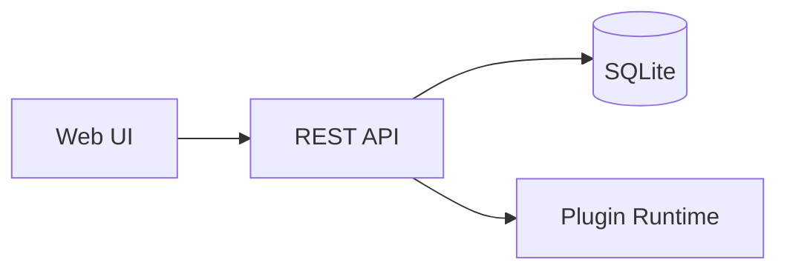

# Project Status

## Overview

This project is **actively maintained** with _regular updates_.

### Task List

- [x] Setup CI/CD pipeline
- [ ] Write ~~unit~~ integration tests
- [ ] Deploy to production

### Architecture



### Code Example

```go
func main() {
    fmt.Println("Hello, Plekt!")
}
```

### Notes

> **Important:** All plugins run in WASM sandbox[^1].

| Component | Status | Owner |
|:----------|:------:|------:|
| Core      | ~~alpha~~ **beta** | Team A |
| Plugins   | alpha  | Team B |

[^1]: See security documentation for details.

---

*Last updated: 2025-01-15*
